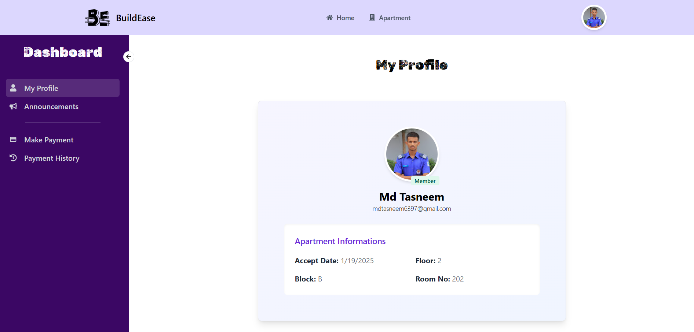
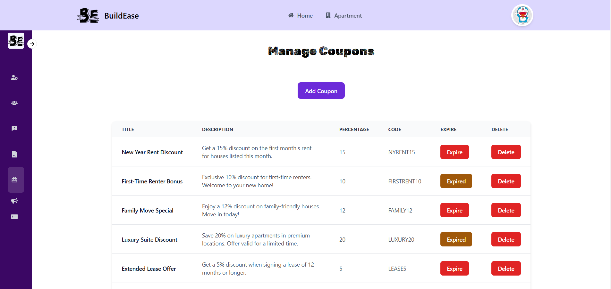
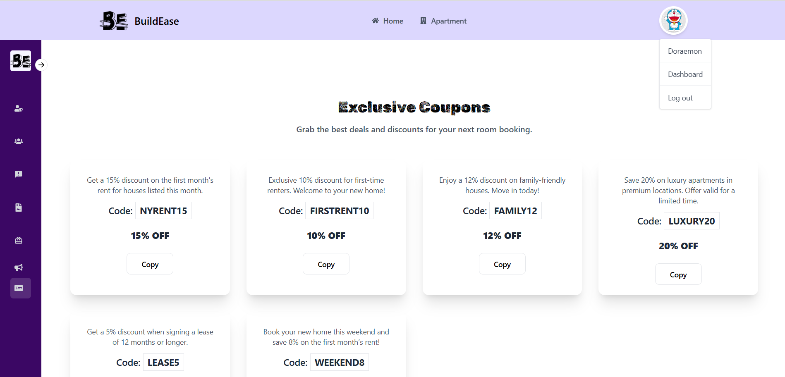
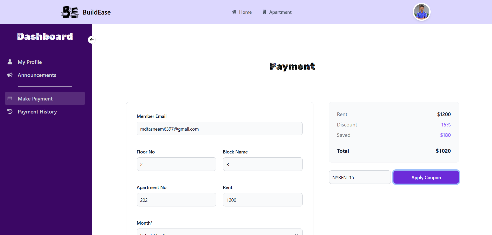

# BuildEase

[](https://buildease-addf0.web.app)

Welcome to **BuildEase**, a comprehensive Building Management System (BMS) designed to streamline the process of renting rooms or apartments. Whether you're a user looking for a rental or an admin managing properties, BuildEase has you covered with a plethora of features and functionalities.






## Features

### User Features
- Easy room and apartment rentals.
- Sorting options to find the perfect rental.
- Payment methods integration with Stripe.
- Coupon availability for discounts.
- User role for seamless navigation.

### Admin Features
- Admin dashboard with responsive sidebar.
- Manage members and users.
- Announcements section for owners.
- Statistics and data visualization.

### General Features
- Authentication with Firebase (Login & Register).
- JWT token for secure session management.
- Image uploads using ImageBB.
- Interactive banner and sliders.
- Toast notifications for a better user experience.

## Technologies and Tools

### Libraries and Frameworks
- **React** (with Vite for fast builds).
- **Tailwind CSS** and **Flowbite React** for responsive UI.
- **Framer Motion** for smooth animations.

### Key NPM Packages
- `@stripe/react-stripe-js` & `@stripe/stripe-js` for payment processing.
- `@tanstack/react-query` for data fetching and caching.
- `axios` for HTTP requests.
- `react-toastify` for toast notifications.
- `react-router-dom` for routing.
- `firebase` for authentication.

## Installation

Follow these steps to set up and run the project locally:

### Prerequisites
Ensure you have the following installed:
- Node.js (v16 or higher)
- npm or yarn

### Steps

1. **Clone the repository:**
   ```bash
   git clone https://github.com/your-username/buildease.git
   cd buildease
   ```

2. **Install dependencies:**
   ```bash
   npm install
   # or
   yarn install
   ```

3. **Set up environment variables:**
   Create a `.env.local` file in the root directory and add the following:
   ```env
   VITE_API_KEY=
   VITE_AUTH_DOMAIN=
   VITE_PROJECT_ID=
   VITE_STORAGE_BUCKET=
   VITE_MESSAGING_SENDER_ID=
   VITE_APP_ID=
   VITE_IMGBB_API_KEY=
   VITE_STRIPE_PK=
   VITE_BACKEND_URL=
   ```

4. **Start the development server:**
   ```bash
   npm run dev
   # or
   yarn dev
   ```

5. **Open in browser:**
   The app should now be running at `http://localhost:5173`.

## Live Site

Experience the live version of BuildEase here: [BuildEase Live Site](https://buildease-addf0.web.app)
